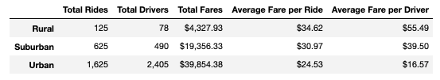
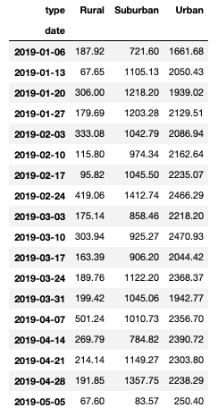
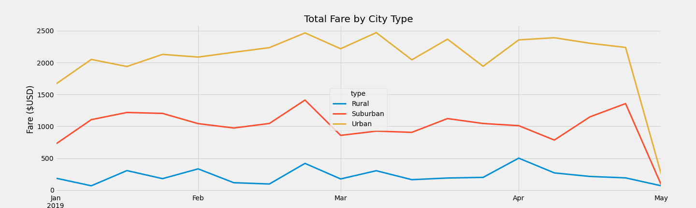

# PyBer Ride-share Data Analysis

## Overview of the Analysis

### Purpose

The purpose of this analysis is to create visualizations of rideshare data for PyBer over the first quarter (January - early May) of 2019 to assist the strategic planning of their ride-sharing services in the hopes of improving access and determining affordability for underserved neighbourhoods. After completing our initial visualizations, we created a summary DataFrame of the ride-sharing data by city type and a multiple-line graph displaying the total weekly fares for each city type. The following report presents our visualizations, summarizes the differences in total weekly fares by city type, and provides recommendations for PyBer to improve their access and affordability. 

## Results

### Differences in ride-sharing data among different city types

Please refer to the below figures and visualizations that illustrate the differences in ride-sharing data among the different city types:

Figure A. Summary DataFrame 

Figure B. Total Weekly Fares by City Type DataFrame

Figure C. **Total Fare by City Type** Line Chart (derived from Figure B)

### Differences in total rides by city type

It is evident just by looking at Figure A that urban cities clocked the highest total number of rides over the four-month tracking period out of all city types. The total number of rides for urban cities is 2.6x greater than that of suburban cities and 13x greater than rural cities. This difference may be due to urban cities having greater population sizes than the other city types, increasing the demand for rideshares. 

### Differences in total drivers by city type 

The above difference for the total number of rides applies to the total number of drivers per city type. The total number of drivers for urban cities is 5x greater than that of suburban cities and 31x greater than rural cities. 

Based on the above metrics, we can assume that urban cities had the most significant demand, as reflected by the total rides and the greatest supply of drivers available for the demand. It is important to note that the supply exceeded the demand for urban cities. On the other hand, the total number of drivers in rural cities is lower than the total number of rides given, which means that the supply did not meet the demand and that drivers may have had to make multiple trips over the four months. 

### Differences in total fares by city type

Urban cities had the highest total fares over the four-month tracking period compared to suburban and rural cities. This finding matches the above two conclusions, which is understandable because the city type with the greatest total number of rides would have the most money made from those rides.

### Differences in average fare per ride by city type

Rural cities had the highest average fare per ride compared to suburban and urban cities. Although the difference between each city type is a few dollars, the average fare for rural cities is $10.00 greater than urban cities.

### Differences in average fare per driver by city type

Rural cities had the highest average fare per driver, which matches the above conclusion for average fare per ride. The average fare per driver for rural cities is almost $40.00 greater than the average fare per driver for urban cities, which is a shocking difference! 

Although rural cities had the fewest number of rides and drivers, they experienced the highest average fare per ride and driver. This discrepancy means that riders in rural cities must pay more for rides and that drivers are charging more for their service, resulting from the low supply of drivers in these cities.

### Differences in weekly total fare by city type

Figure C displays the apparent difference in total fares by city type. Throughout the entire four-month tracking period, urban cities experienced the highest total fares compared to suburban and rural cities. All three city types experienced peaks in their total fares during the week of February 24, 2019, followed by a decline. Despite all three cities generally following the same trend in peaks and dips until March 2019, urban cities consistently had the highest total fares, irrespective of the trend.

